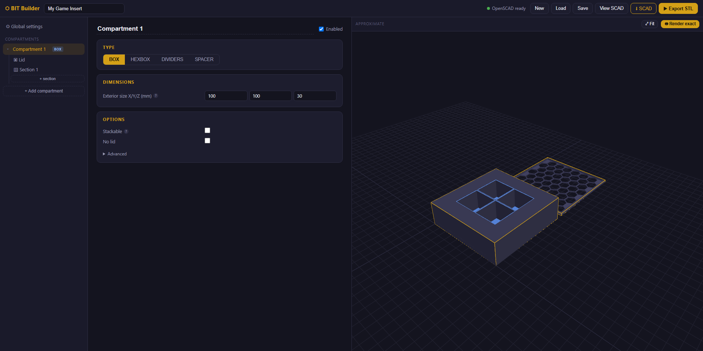

# BIT Builder

A local graphical designer for 3D-printable board game inserts, built on
[The Boardgame Insert Toolkit](https://github.com/dppdppd/The-Boardgame-Insert-Toolkit) (BIT) v3.
Design compartments (boxes, hexboxes, divider sets, spacers), their sections and lids
in a visual editor — the OpenSCAD code is generated for you, with live 3D preview
and one-click STL export.



## Run it

- **Windows:** double-click **`run.bat`**
- **macOS / Linux:** `./run.sh`

…then open <http://127.0.0.1:5000>. Everything runs locally; nothing leaves your machine.

Requirements:
- **Python 3** with Flask (`pip install -r requirements.txt` — the launchers do this automatically)
- **[OpenSCAD](https://openscad.org)** — only needed for *Render exact* and *Export STL*;
  designing and downloading `.scad` files works without it.

Developed and tested on Windows; the backend knows the standard OpenSCAD install
locations on macOS and Linux as well.

## Using the app

| Area | What it does |
|---|---|
| **Left sidebar** | Your compartments: box, hexbox, divider and spacer types — each compartment holds a lid and sections (grids of cells). |
| **Middle editor** | Every BIT option for the selected item, common settings up front, the rest under *Advanced*. Hover the `?` dots for explanations. |
| **Right panel** | Live approximate 3D preview (orbit with the mouse). **Render exact** runs OpenSCAD for a faithful preview. Fit warnings appear below the canvas. |
| **View SCAD** | Live generated OpenSCAD code; copy or download it. |
| **Export STL** | Full-quality render, downloads the STL. Isolate a single part in *Global settings → Output filter* to print parts separately. |

Projects auto-save in the browser; use **Save/Load** for `.json` project files.

To use a downloaded `.scad` file directly in OpenSCAD, keep it next to the two
library files from `Master Files/` (`boardgame_insert_toolkit_lib.3.scad`,
`bit_functions_lib.3.scad`).

## Project layout

```
app.py                    Thin Flask backend (serves app, runs OpenSCAD CLI)
Master Files/             The BIT OpenSCAD library (v3)
static/js/schema.js       ★ Single source of truth: every toolkit option as data
static/js/scadgen.js      Schema-driven SCAD generator + fit validation
static/js/preview3d.js    three.js preview (approximate + exact STL modes)
static/js/app.js          Vue 3 application
static/vendor/            Vue + three.js, vendored locally (works offline)
legacy_v1/                Archived first version (reference only)
```

To expose a new toolkit option, add one entry to a field list in
`static/js/schema.js` — the editor UI and the SCAD output both pick it up automatically.

## License & attribution

- **App code:** MIT (see [LICENSE](LICENSE)).
- **`Master Files/`** bundles [The Boardgame Insert Toolkit](https://github.com/dppdppd/The-Boardgame-Insert-Toolkit)
  by Ido Magal, © 2020, licensed
  [CC BY-NC-SA 4.0](https://creativecommons.org/licenses/by-nc-sa/4.0/) —
  attribution required, **non-commercial**, share-alike. All credit for the insert
  generation engine goes to that project; this app is a GUI that writes code for it.
- **`static/vendor/`** contains [Vue.js](https://vuejs.org) and [three.js](https://threejs.org), both MIT.

Because the bundled toolkit is non-commercial, this repository as a whole must not
be used commercially.
